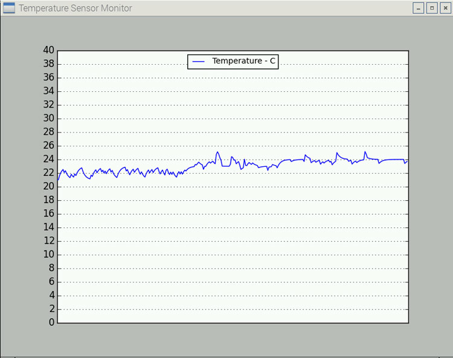

# 数据显示与存储
###显示数据
Matplotlib是一个Python的图形框架，它可以让我们采集到的大量数据转换为图形显示出来。
在树莓派上可以很方便安装它。Matplotlib的官方网站：http://matplotlib.org/
```
sudo apt-get install python-wxgtk2.8
sudo pip install matplotlib numpy
```
采集温度曲线示例
```
#-*- coding: UTF-8 -*-
import wx
from matplotlib.figure import Figure
import matplotlib.font_manager as font_manager
import numpy as np
from megapi import *
from matplotlib.backends.backend_wxagg import  FigureCanvasWxAgg as FigureCanvas

TIMER_ID = wx.NewId()
POINTS = 300
def onRead(temperature):
  global lastValue
  lastValue = temperature
  
lastValue = 0

class PlotFigure(wx.Frame):
    def __init__(self):
        wx.Frame.__init__(self, None, wx.ID_ANY, title="Temperature Sensor Monitor", size=(800, 600))
        #设置窗口大小
        self.bot = MegaPi()
        self.bot.start()
        #初始化MegaPi
        self.fig = Figure((8, 6), 100)
        self.canvas = FigureCanvas(self, wx.ID_ANY, self.fig)
        self.ax = self.fig.add_subplot(111)
        self.ax.set_ylim([0, 240])
        self.ax.set_xlim([0, POINTS])
        self.ax.set_autoscale_on(False)
        self.ax.set_xticks([])
        self.ax.set_yticks(range(0, 241, 10))
        self.ax.grid(True)
        #设置网格标志
        self.user = [None] * POINTS
        self.l_user,=self.ax.plot(range(POINTS),self.user,label='Temperature - C')
        self.ax.legend(loc='upper center',
                           ncol=4,
                           prop=font_manager.FontProperties(size=10))
        self.canvas.draw()
        self.bg = self.canvas.copy_from_bbox(self.ax.bbox)
        wx.EVT_TIMER(self, TIMER_ID, self.onTimer)

    def onTimer(self, evt):
        global lastValue
        self.canvas.restore_region(self.bg)
        temp =lastValue
        self.bot.temperatureSensorRead(6,1,onRead)
        self.user = self.user[1:] + [temp]
        self.l_user.set_ydata(self.user)
        self.ax.draw_artist(self.l_user)
        self.canvas.blit(self.ax.bbox)
        
if __name__ == '__main__':
    app = wx.PySimpleApp()
    frame = PlotFigure()
    t = wx.Timer(frame, TIMER_ID)
    t.Start(50)
    frame.Show()
    app.MainLoop()
```
###运行效果

###数据存储
```
from megapi import *
import time
def onRead(v):
  f.write( time.strftime('%Y-%m-%d %H:%M:%S',time.localtime(time.time()))+' '+str(v)+' C\n')
  
lastValue = 0
f = open('result.txt','wb')
bot = MegaPi()
bot.start()
while True:
    bot.humitureSensorRead(6,1,onRead)
    sleep(2)
```