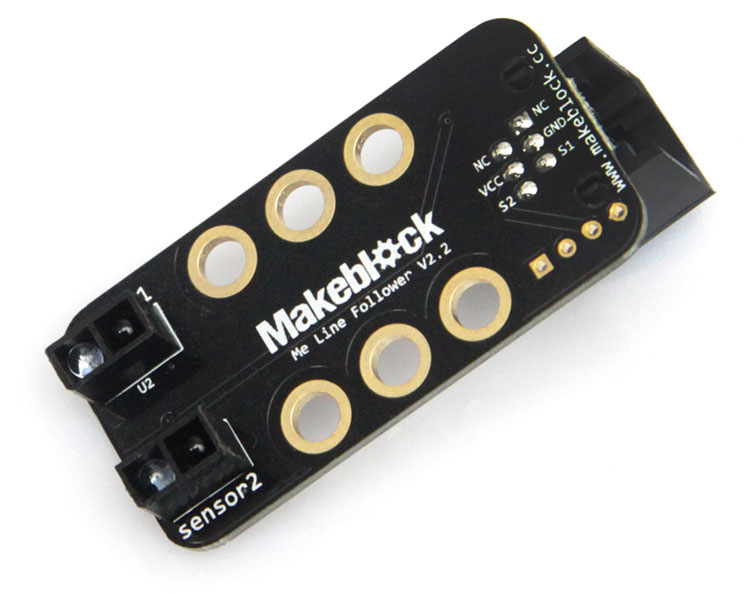

# 检测光线强度

彩色传感器的工作原理是彩色的LED发射彩色的光，遇到前方物体发生反射，彩色的LED发射的只有一种单一色彩的光，当接触到不同颜色物体表面时，其反射回来的光的强度也不一样，传感器会自行判断是否是所要探测的色彩信号，从而给单片机发送相应的信号，达到控制的要求。
而巡线传感器只需要判断黑白两色，可以只发射红外光，黑色的反射率低于白色的反射率，从而区分黑色和白色。

### 巡线传感器



### Python 代码
```
from megapi import *

def onRead(v):
	if v==0:
      print "both are white"
	if v==1:
      print "left is white, right is black"
	if v==2:
      print "left is black, right is white"
	if v==3:
      print "both are black"

bot = MegaPi()
bot.start()
port = 6
while True:
    sleep(0.1)
    bot.lineFollowerRead(port,onRead)
```
### 运行结果

### 光线传感器

### Python代码
```
from megapi import *

def onRead(v):
	print "level:"+str(v)

bot = MegaPi()
bot.start()
port = 6
while True:
    sleep(0.1)
    bot.lightSensorRead(port,onRead)
```
```