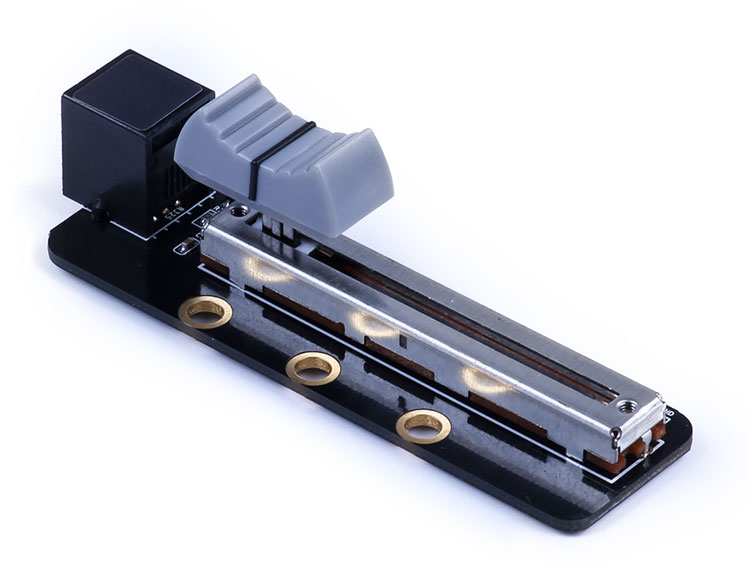
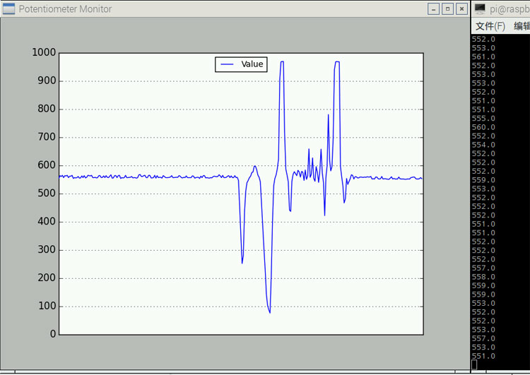
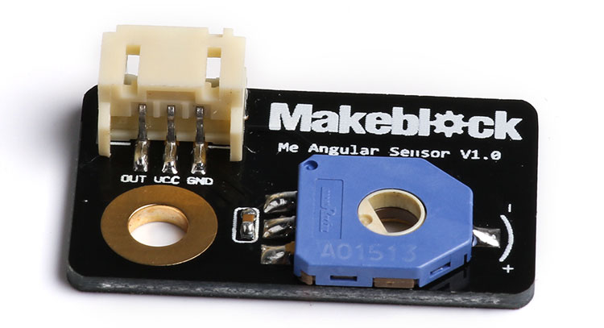

# 电位器

电位器是具有三个引出端、阻值可按某种变化规律调节的电阻元件。电位器通常由电阻体和可移动的电刷组成。当电刷沿电阻体移动时，在输出端即获得与位移量成一定关系的电阻值或电压。
###旋转电位器

###滑动变阻器

###Python 代码
```
from megapi import *

def onRead(v):
	print "value:"+str(v)

bot = MegaPi()
bot.start()
port = 6
while 1:
    sleep(0.1)
    bot.potentiometerRead(port,onRead)
```
###运行结果


###摇杆
摇杆内部包含2个电位器，通过机械旋转的角度改变电位器的阻值，从而单片机可以通过阻值获取摇杆所处的位置。


###Python 代码
```
from megapi import *

def onReadX(v):
	print "axis X:"+str(v)
    bot.joystickRead(port,axisY,onReadY)
    
def onReadY(v):
	print "axis Y:"+str(v)

bot = MegaPi()
bot.start()
port = 6
axisX = 1
axisY = 2
while True:
    sleep(0.2)
    bot.joystickRead(port,axisX,onReadX)
```
###运行结果

###角度传感器

### Python 代码
```
from megapi import *

def onRead(v):
	print "angular:"+str(v)

bot = MegaPi()
bot.start()
port = 6
slot = 1
while True:
    sleep(0.1)
    bot.angularSensorRead(port,slot,onRead)
```