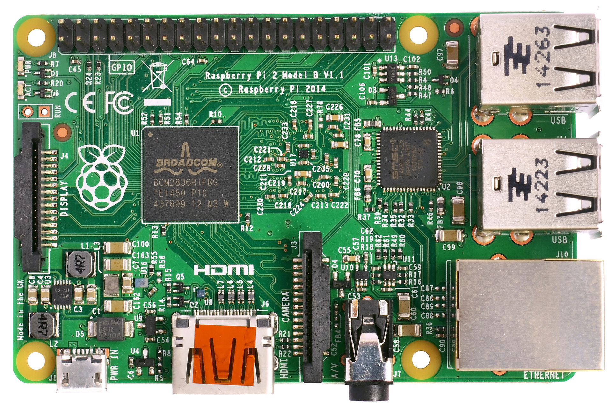

# 准备树莓派和MegaPi
树莓派（英语：Raspberry Pi），是一款基于Linux的单板机电脑。它由英国的树莓派基金会所开发，目的是以低价硬件及自由软件刺激在学校的基本计算机科学教育。

树莓派2 B型使用一枚博通（Broadcom）出产的ARM架构900MHz Cortex-A7处理器，512MB內存，使用Micro SD卡当作存储媒体，且拥有一个Ethernet、两个USB接口、以及HDMI（支持声音输出）和RCA端子输出支持。树莓派只有一张信用卡大小，体积大概是一个火柴盒大小，可以运行像《雷神之锤III竞技场》的游戏和进行1080p视频的播放。操作系统采用开源的Linux系统如Debian、ArchLinux，自带的Iceweasel、KOffice等软件，能够满足基本的网络浏览、文字处理以及电脑学习的需要。分A、B两种型号，售价分别是A型25美元、B型35美元。

树莓派基金会提供了基于ARM架构的Debian、Arch Linux和Fedora等的发行版供大众下载，支持Python、vascript、C语言和Perl等编程语言。

树莓派基金会于2016年2月发布了树莓派3,较前一代树莓派2，树莓派3的处理器升级为了64位的博通BCM2837，并首次加入了Wi-Fi无线网络及蓝牙功能，而售价仍然是35美元。

