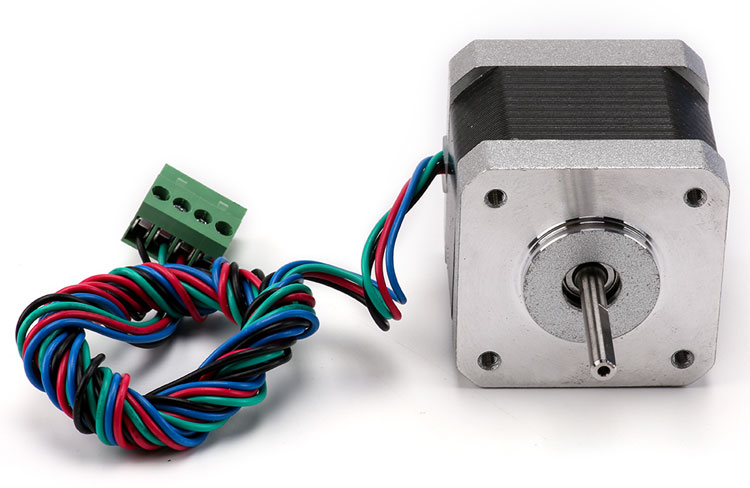

# 步进电机
步进电机是将电脉冲信号转变为角位移或线位移的开环控制元步进电机件。在非超载的情况下，电机的转速、停止的位置只取决于脉冲信号的频率和脉冲数，而不受负载变化的影响，当步进驱动器接收到一个脉冲信号，它就驱动步进电机按设定的方向转动一个固定的角度，称为“步距角”，它的旋转是以固定的角度一步一步运行的。可以通过控制脉冲个数来控制角位移量，从而达到准确定位的目的；同时可以通过控制脉冲频率来控制电机转动的速度和加速度，从而达到调速的目的。
###步进电机


###连线

###Python 代码
```

```
###运行结果