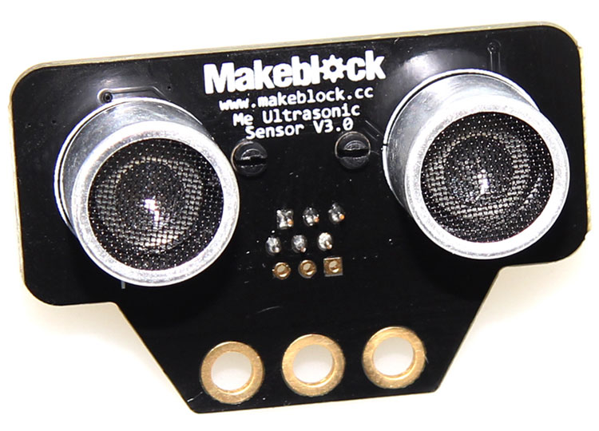
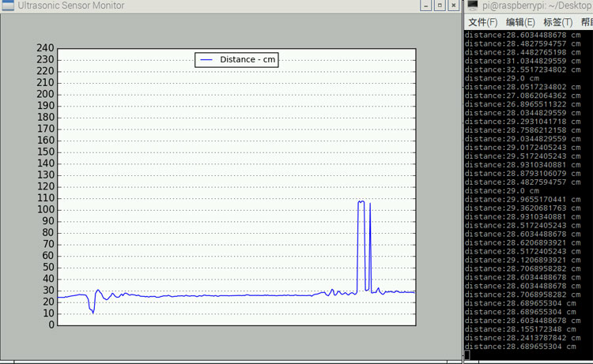

# 检测障碍物距离

跟雷达的原理类似，超声波测距传感器通过发射器向某一方向发射超声波，在发射时刻的同时开始计时，超声波在空气中传播，途中碰到障碍物就立即返回来，超声波接收器收到反射波就立即停止计时。（超声波在空气中的传播速度为340m/s，根据计时器记录的时间t，就可以计算出发射点距障碍物的距离s，即：s=340t/2）

为了使移动机器人能自动避障行走，就必须装备测距系统，以使其及时获取距障碍物的距离和方向。


### 超声波测距传感器




### Python代码
```
from megapi import *

bot = MegaPi()
bot.start()

def onRead(v):
	print "distance:"+str(v)+" cm"
    
port = 6 
while 1:
    sleep(0.1)
    bot.ultrasonicSensorRead(port,onRead)

```

### 运行结果

